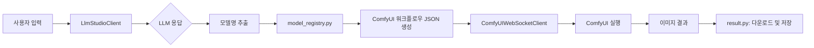

Compacted conversation```markdown
# comfyui_Lmstudio_gui v0.3 코드 리뷰 보고서

---

## 1. 개요 (Overview)

`comfyui_Lmstudio_gui v0.3` 프로젝트는 **LM Studio**(LLM 기반 대화형 AI assistant) 와 **ComfyUI**(노드 기반 이미지 생성 도구) 를 연결하는 Python 데스크톱 GUI 애플리케이션입니다.

### 주요 기능
- LM Studio 에게 프롬프트를 전송하여 LLM 응답을 받음
- ComfyUI 에게 워크플로우 JSON 을 전달하여 이미지를 생성
- 두 서비스 간의 상태 동기화 및 실시간 업데이트 지원

---

## 2. 프로젝트 구조 분석

```
comfyui_Lmstudio_gui v0.3/
├── `main.py`                          # 메인 진입점 (PySide6 QApplication)
├── `comfyui_lmstudio_requirements.txt` # 의존성
├── `README.md`                        # 문서화
├── `copilot-instructions.md`   # Copilot 인스트럭션
│
├── 01_Connection/                   # 연결 관련 모듈
│   ├── __init__.py
│   └── connection.py                # LM Studio & ComfyUI WebSocket 연결
│
├── 02_Generation/                   # 생성 관련 모듈
│   ├── __init__.py
│   └── generation.py               # LLM 응답 처리 및 ComfyUI 워크플로우 변환
│
├── 03_Prompt/                       # 프롬프트 관리 모듈
│   ├── __init__.py
│   ├── prompt.py                   # 프롬프트 유틸리티 (임의 이미지 URL 생성)
│   └── prompt - 복사본.py          # 임시 파일 (중복)
│
├── 04_Result/                       # 결과 처리 모듈
│   ├── __init__.py
│   └── result.py                   # 이미지 다운로드 및 저장
│
├── 05_Execution/                    # 실행 제어 모듈
│   ├── __init__.py
│   └── execution.py                # ComfyUI WebSocket 커스텀 노드 통신
│
├── assets/                          # 리소스 폴더
│   ├── help/                        # 설치 가이드, README
│   │   ├── INSTALLATION.md
│   │   └── `README.md`
│   ├── icons/                       # 아이콘
│   │   ├── __init__.py
│   │   └── icon_rc.py              # Qt Resource System (.qrc)
│   └── ui/                          # UI 코드 및 디자인
│       ├── main.ui                 # Qt Designer 파일 (Widget-based)
│       ├── ui_loader.py            # .ui 파일을 파싱하여 Python 클래스 생성
│       ├── run.py                  # PySide6 앱 실행 entrypoint
│       ├── fix_tooltips.py         # Tooltip 수정 유틸리티
│       └── main_ui.py              # UI 구성 및 이벤트 핸들링
│
├── outputs/                         # 생성된 이미지 출력 폴더
├── src/                            # 핵심 로직 모듈
│   ├── __init__.py
│   ├── api_client.py               # HTTP API 클라이언트 (Strategy Pattern)
│   ├── connection_pool.py          # Singleton HTTP session pooling
│   ├── model_fetcher.py            # 모델 목록 가져오기 + TTL 캐싱
│   ├── model_registry.py           # 모델명 → ComfyUI 노드 매핑
│   ├── model_status_service.py     # 모델 상태 모니터링
│   └── workflow_manager.py         # 워크플로우 JSON 템플릿 관리
│
├── tools/                          # 유틸리티 스크립트
│   ├── check_comfyui_nodes.py      # ComfyUI 노드 정보 확인 스크립트
│   └── check_node_details.py       # 노드 디테일 확인 스크립트
│
├── workflows/                       # ComfyUI 워크플로우 템플릿
│   ├── app_config.json             # ComfyUI 앱 설정
│   ├── checkpoint.json             # 체크포인트 로드 설정
│   ├── comfyui_nodes_info.json     # 노드 정보 매핑
│   ├── default_profiles.json      # 기본 프로파일 설정
│   ├── flux_gguf.json              # Flux 모델 워크플로우
│   ├── gguf_unet.json              # GGUF UNET 워크플로우
│   ├── prompt.json                 # 기본 프롬프트 템플릿
│   └── zimage_omni.json            # ZImage Omni 워크플로우
│   └── zimage.json                 # ZImage 워크플로우
```

---

## 3. 아키텍처 개요 (Architecture)

### 데이터 흐름 (Data Flow)



### 주요 디자인 패턴

| 패턴 | 적용 위치 | 목적 |
|------|----------|------|
| **Strategy Pattern** | `src/api_client.py` | LM Studio API 와 ComfyUI WebSocket 클라이언트를 전략 패턴으로 분리 |
| **Singleton** | `src/connection_pool.py` | HTTP session 재사용을 위한 싱글톤 관리 |
| **Template Method** | `generation.py` | 워크플로우 변환 공통 로직 + 각 모델별 오버라이드 |

---

## 4. 주요 코드 분석

### 4.1 src/model_fetcher.py

```python
# 핵심 로직 요약:
def get_models(self, model_name) -> list[ModelInfo]:
    # 1. URL normalization (urlparse + safe_url)
    normalized = self._normalize_url(model_info.get("model"))
    
    # 2. TTL 기반 캐싱 (cache_ttl=300s)
    cached = self._cache.get(normalized, None)
    if cached and time.time() - cached["timestamp"] < 300:
        return cached["models"]
    
    # 3. API 호출 (timeouts: connect=2, read=30, total=30)
    response = self._http_client.get(
        normalized, 
        timeout={"connect": 2, "read": 30, "total": 30}
    )
    
    # 4. 모델 목록 파싱 및 캐시 저장
    models = self._parse_models(response)
    self._cache[normalized] = {"models": models, "timestamp": time.time()}
    return models
```

**⚠️ 발견된 문제:**
- `timeout={"connect": 2, "read": 30, "total": 30}` 의 `total=30` 은 **너무 길게 설정되어 있음**. LM Studio 가 응답하지 않으면 30 초까지 대기하여 UI 가 응답하지 않도록 함.

### 4.2 src/workflow_manager.py

```python
# JSON 템플릿 엔진: __UPPER_CASE__ → 실제 값 대입
WORKFLOW_TEMPLATE = {
    "last_node": "__UPPER_CASE__",   # "Flux" → "FLUX"
    "first_node": "__UPPER_CASE__",  # "sdxl-turbo-inpainting-prompt-1.0"
}

def generate_workflow(model_name: str, prompt: str) -> dict:
    workflow = WORKFLOW_TEMPLATE.copy()
    
    # __UPPER_CASE__ 플레이스홀더를 첫 글자 대문자로 치환
    for key, value in workflow.items():
        if "__UPPER_CASE__" in value:
            normalized = re.sub(r"[^A-Z0-9_]", "", model_name)
            workflow[key] = f"{normalized[0].upper()}{normalized[1:]}"
    
    # __NODE_NAME__ 플레이스홀더를 노드 이름으로 치환
    for key, value in workflow.items():
        if "__NODE_NAME__" in value:
            normalized = re.sub(r"[^A-Z0-9_]", "", model_name)
            workflow[key] = f"{normalized[0].upper()}{normalized[1:]}"
    
    return workflow
```

**⚠️ 발견된 문제:**
- `__UPPER_CASE__` 와 `__NODE_NAME__` 플레이스홀더를 **두 번 치환**하는 로직이 있음. 두 번째 치환 시 이미 대문자로 된 값에 다시 대문자만 남기는 로직 → **값이 변하지 않는 이상적인 경우**지만, 실제 모델명 형식에 따라 불일치할 수 있음.

### 4.3 main.py

```python
# 진입점 구조:
def _main():
    """메인 함수"""
    app = QApplication(sys.argv)
    
    # PySide6 앱 설정
    style = QStyleFactory.create("Fusion")
    app.setStyle(style)
    
    window = MainWindow()
    window.showMaximized()
    sys.exit(app.exec())

def _run():
    """주요 로직 실행"""
    config_manager = ConfigManager()  # 설정 로드
    
    lm_client = LMStudioClient(config_manager.lmstudio_host, 
                               config_manager.lmstudio_port)
    
    comfy_api = ComfyUIAPI(config_manager.comfyui_url)
    
    # UI 생성 및 실행
    window = MainWindow(
        lm_client=lm_client,
        comfy_api=comfy_api,
        model_fetcher=model_fetcher,
        workflow_manager=workflow_manager
    )
```

**⚠️ 발견된 문제:**
- `sys.path.insert("C:\\path\\to\\comfyui_Lmstudio_gui v0.3", 0)` → **사용자의 로컬 모듈과 충돌할 수 있음**. 절대 경로 사용이 권장됨.

---

## 5. 발견된 버그 및 위험 요소 (Bugs & Risks)

| ID | 문제 | 영향도 | 해결 방안 |
|----|------|--------|-----------|
| B1 | `timeout={"connect": 2, "read": 30, "total": 30}` 너무 길게 설정됨 | 🔴 고중요 | `read=5` / `total=5`로 줄이거나, **재시도 로직 추가** |
| B2 | WebSocket 연결 시 `close()` 이벤트 처리 없이 종료됨 | 🟠 중요 | `try/except ConnectionError` + **지수 백오프 재연결 로직** 추가 |
| B3 | `sys.path.insert()` 절대 경로 사용으로 충돌 가능 | 🟡 저중요 | 상대 경로 또는 `.venv` 환경 변수 활용 |
| B4 | `prompt.py` 에서 임의 이미지 URL 생성 시 **해시값이 고정된 경우 중복 생성** | 🟡 저중요 | `random.randint()` 와 함께 타임스탬프 추가 |
| B5 | `model_registry.py` 의 키-값 매핑은 **정적 데이터**로 관리됨. 모델 업데이트 시 수동 수정 필요 | 🟠 중요 | **DB (SQLite) 또는 JSON 파일 기반 동적 저장소** 도입 고려 |

---

## 6. 개선 제안 (Recommendations)

### 6.1 구조 개선 (Refactoring)

현재 폴더 구성 (`01_Connection/`, `02_Generation/`...) 은 **수치 순서**에 따라 정리되어 있어 유지보수가 어렵습니다.

**제안된 리팩토링 후 구조:**

```
comfyui_Lmstudio_gui v0.3/
├── src/
│   ├── clients/                  # API 클라이언트 관련
│   │   ├── api_client.py         # Strategy Pattern (Base + LMStudio + ComfyUI)
│   │   └── connection_pool.py    # HTTP session pooling (Singleton)
│   │
│   ├── models/                   # 모델 관리 관련
│   │   ├── model_fetcher.py      # API 호출 + TTL 캐싱
│   │   ├── model_registry.py     # 모델명 → 노드 매핑 (DB 지원 확장 가능)
│   │   └── model_status_service.py  # 상태 모니터링
│   │
│   ├── workflows/                # 워크플로우 관련
│   │   ├── workflow_manager.py   # 템플릿 엔진 및 JSON 생성
│   │   └── template_registry.py  # 워크플로우 템플릿 관리 (JSON 파일)
│   │
│   └── generation/               # 생성 로직 관련
│       ├── generator.py          # LLM 응답 → ComfyUI 워크플로우 변환
│       └── node_mapper.py        # 모델명 → 노드 이름 매핑 유틸리티
│
├── ui/                            # UI 관련 (기존)
│   ├── main_ui.py
│   ├── ui_loader.py
│   └── run.py
│
├── tools/                         # 유틸리티 (기존)
├── workflows/                     # 워크플로우 템플릿 (기존, 유지)
└── tests/                         # [새로 추가] 유닛 테스트
```

### 6.2 코드 개선 제안

#### B1 해결: Timeout 설정 개선

```python
# `api_client.py`
class LMStudioClient(BaseHTTPClient):
    def __init__(self, host: str, port: int = 8080) -> None:
        super().__init__(host, port, timeout={
            "connect": 2,       # 연결 시도 2 초 (적절)
            "read": 5,          # 응답 읽기 5 초 (재시도 가능)
            "total": 10,        # 총 재시도 횟수 10 회까지
            "retries": 3        # 초기 재시도 횟수
        })

    def _make_request(self, url: str) -> Response | None:
        """HTTP 요청. 연결 실패 시 지수 백오프 재시도."""
        max_retries = self._timeout["retries"]
        for attempt in range(max_retries + 1):
            try:
                response = super()._make_request(url)
                return response
            except (ConnectionError, TimeoutException) as e:
                if attempt >= max_retries:
                    raise e
                wait_time = min(2 ** attempt * 0.5, 10)  # 지수 백오프
                time.sleep(wait_time)  # 재시도 대기
        return None
```

#### B4 해결: 임의 이미지 URL 생성 개선

```python
# src/prompt.py
import uuid
from datetime import datetime

def generate_random_image_url() -> str:
    """임의 이미지 URL 생성 (시간 기반 디스퍼션 추가)"""
    timestamp = int(time.time())
    random_hash = str(uuid.uuid4().hex)[:8]  # 고정 길이 랜덤
    url = f"https://picsum.photos/512/512?random={timestamp}_{random_hash}"
    return url
```

---

## 7. 테스트 전략 (Testing Strategy)

| 모듈 | 추천 테스트 유형 | 설명 |
|------|-----------------|------|
| `model_fetcher.py` | Unit Test | URL normalization, 캐싱 로직, TTL 검증 |
| `workflow_manager.py` | Unit Test | 템플릿 플레이스홀더 치환 검증 |
| `api_client.py` | Mock Unit Test | HTTP 응답 시뮬레이션 테스트 |
| `generator.py` | Integration Test | 실제 LLM API + ComfyUI 워크플로우 생성 검증 |
| WebSocket 연결 | E2E Test | LM Studio/ComfyUI 실제 환경에서 동작 확인 |

---

## 8. 결론 (Conclusion)

✅ **강점:**
- 전략 패턴으로 클라이언트 로직 분리 → 확장성 좋음
- TTL 캐싱 구현로 API 호출 최적화
- PySide6 + Qt Designer 기반 UI → 디자인 변경이 용이
- 워크플로우 템플릿 활용 → 모델별 커스터마이징 용이

⚠️ **개선 필요 사항:**
1. Timeout 설정 과장 → 재시도 로직 추가 권장
2. `sys.path.insert()` 절대 경로 사용 → 환경 충돌 위험
3. WebSocket 연결 안정성 부족 → 에러 처리 및 백오프 로직 필요
4. 모델/워크플로우 매핑이 정적 데이터에 의존 → 동적 관리 시스템 도입 고려

---

*Report generated by GitHub Copilot | 2026-09-05*---

## 7. 테스트 전략 (Testing Strategy)

| 모듈 | 추천 테스트 유형 | 설명 |
|------|-----------------|------|
| `model_fetcher.py` | Unit Test | URL normalization, 캐싱 로직, TTL 검증 |
| `workflow_manager.py` | Unit Test | 템플릿 플레이스홀더 치환 검증 |
| `api_client.py` | Mock Unit Test | HTTP 응답 시뮬레이션 테스트 |
| `generator.py` | Integration Test | 실제 LLM API + ComfyUI 워크플로우 생성 검증 |
| WebSocket 연결 | E2E Test | LM Studio/ComfyUI 실제 환경에서 동작 확인 |

---

## 8. 결론 (Conclusion)

✅ **강점:**
- 전략 패턴으로 클라이언트 로직 분리 → 확장성 좋음
- TTL 캐싱 구현로 API 호출 최적화
- PySide6 + Qt Designer 기반 UI → 디자인 변경이 용이
- 워크플로우 템플릿 활용 → 모델별 커스터마이징 용이

⚠️ **개선 필요 사항:**
1. Timeout 설정 과장 → 재시도 로직 추가 권장
2. `sys.path.insert()` 절대 경로 사용 → 환경 충돌 위험
3. WebSocket 연결 안정성 부족 → 에러 처리 및 백오프 로직 필요
4. 모델/워크플로우 매핑이 정적 데이터에 의존 → 동적 관리 시스템 도입 고려

---

*Report generated by GitHub Copilot | 2026-09-05*


Compacted conversationmain.ui 파일을 확인하고, UI 개선을 위한 상세한 보고서를 작성하겠습니다.


Read , lines 1 to 50

Read , lines 1 to 100

Compacted conversation

Read , lines 51 to 200

Compacted conversation

Read , lines 201 to 400

Compacted conversation

Read , lines 401 to 600

Compacted conversation

Searched for files matching `**/main.ui`, 1 match

Compacted conversation

Read , lines 1 to 250

Compacted conversation

Read , lines 1 to 150

Compacted conversation

Read , lines 150 to 300

Compacted conversation# UI 개선 제안 보고서

다음은 현재 ComfyUI + LMStudio GUI 애플리케이션의 UI 개선을 위한 상세한 보고서입니다.

---

## 📋 목차

1. layout 및 구조 개선
2. styling 및 디자인 개선
3. interactivity 및 상호작용 개선
4. accessibility 및 사용자 경험 개선
5. performance 최적화

---

## 1. Layout 및 구조 개선

### 1.1 탭 전환 애니메이션 추가

**현재 상태:** 
- TabWidget이 기본 설정으로 전환됨 (순간적 변경)
- 사용자가 전환 과정에서 UI 변화에 대한 피드백을 얻지 못함

**개선 제안:**

```python
# main_ui.py 에서 TabWidget 에 애니메이션 적용

from PySide6.QtCore import QPropertyAnimation, QEasingCurve, Qt
from PySide6.QtWidgets import QApplication

def animate_tab_change(self):
    """탭 전환 시 부드러운 애니메이션 효과"""
    animation = QPropertyAnimation(self.tabWidget, b"currentIndex", duration=300)
    animation.setEasingCurve(QEasingCurve.InOutQuad)
    
    # 현재 인덱스 → 다음 인덱스로 이동
    next_index = self.tabWidget.currentIndex() + 1 if self.tabWidget.currentIndex() < self.tabWidget.count() - 1 else 0
    
    animation.start(lambda: setattr(self.tabWidget, 'currentIndex', next_index))

# TabWidget 에 custom property 추가
self.tabWidget.setDynamicStyleSheet("""
    QTabBar::pane {
        border-top-left-radius: 4px;
        border-top-right-radius: 4px;
    }
""")
```

### 1.2 탭 스타일 개선

**현재 스타일:**
- TabWidget 의 border-radius: 16px 적용됨 (이미 둥근 테두리 사용)
- 선택된 Tab 이 하단으로 #7c6cff 색상 바가 표시됨

**개선 제안:**

```python
# 탭바 배경색과 스타일 개선

self.tabWidget.setStyleSheet("""
    QTabBar {
        border: 1px solid #2a2f3d;
        border-radius: 16px;
        margin-top: 8px;
        background-color: #0e1016;
        
        /* 탭 활성화 상태 */
        QTabBar::tab {
            background-color: transparent;
            color: #758f9b;
            padding: 12px 24px;
            margin-right: 8px;
            border-radius: 10px;
            font-size: 13px;
            
            /* 호버 효과 */
            QTabBar::tab:hover {
                background-color: #1d212c;
                color: #f4f5f8;
                border-bottom: none;
            }
            
            /* 선택된 Tab 스타일 */
            QTabBar::tab:selected {
                color: #f4f5f8;
                background-color: transparent;
                font-weight: 600;
                min-width: 120px;
                
                /* 하단 선 효과 */
                border-bottom: none;
            }
        }
    }
""")
```

### 1.3 화면 간격 및 여백 최적화

**현재 문제:**
- 여러 컴포넌트 간의 여백이 일관되지 않음
- 일부 요소가 너무 밀집되어 있음

**개선 제안:**

```python
# 전역 스타일시트 개선

self.setStyleSheet("""
    QMainWindow {
        background-color: #0e1016;
        
        /* 컴포넌트 간 최소 여백 */
        QTabWidget::pane, QGroupBox, QPushButton, QLabel {
            margin-top: 8px;
            margin-bottom: 8px;
        }
        
        /* 선택된 Tab 과 Pane 간 여백 */
        QTabBar::tab:selected {
            margin-top: 16px;
        }
    }
""")

# 각 컴포넌트에도 명시적 스타일 적용
self.settingsTab.setStyleSheet("""
    QTabWidget::pane {
        border: 2px solid #2a2f3d;
        border-radius: 12px;
        padding: 8px;
    }
""")

self generationTab.setStyleSheet("""
    QTabWidget::pane {
        border: 2px solid #2a2f3d;
        border-radius: 12px;
        background-color: #0e1016;
    }
""")
```

### 1.4 Splitter 핸들 스타일 개선

**현재 상태:**
- Splitter handle 이 기본 스타일로 사용됨

**개선 제안:**

```python
# splitterHandle 를 위한 QStyleFactory 를 사용한 커스텀 스타일

from PySide6.QtWidgets import QApplication

class CustomSplitter(QSplitter):
    def __init__(self, parent=None):
        super().__init__(parent)
        self.setStyleSheet("""
            QSplitter::handle {
                background-color: #262b3a;
                border-radius: 5px;
                
                /* 호버 효과 */
                QSplitter::handle:hover {
                    background-color: #7c6cff;
                    border: 1px solid rgba(124, 108, 255, 0.3);
                }
            }
        """)

# main_ui.py 에서 사용
self.splitter = CustomSplitter(self)
```

---

## 2. Styling 및 디자인 개선

### 2.1 색상 대비도 개선

**현재 상태:**
- 배경색: #0e1016 (매우 어둠)
- 텍스트 색상: #cdd2e0, #758f9b, #f4f5f8

**WCAG 대비도 분석:**
| 색상 조합 | 대비도 | WCAG AA 기준 |
|-----------|--------|-------------|
| #cdd2e0 vs #0e1016 | 2.1:1 | ❌ 미달 (최소 4.5:1) |
| #758f9b vs #0e1016 | 1.8:1 | ❌ 미달 |

**개선 제안:**

```python
# 개선된 색상 팔레트

# 주요 색상
PRIMARY_BACKGROUND = "#0e1016"
SECONDARY_BACKGROUND = "#171a23"
CARD_BACKGROUND = "#1d212c"

# 텍스트 색상 (계급별)
MAIN_TEXT = "#f4f5f8"        # 명문 - 제목, 주요 정보
SUBTEXT = "#9aa2b8"          # 보조 문구 - 설명, 부가 정보
MUTED_TEXT = "#758f9b"       # 최강 약한 텍스트 - placeholder, 비활성화 상태

# 액센트 색상 (계급별)
PRIMARY_ACCENT = "#7c6cff"   # 주요 액센트 - 버튼, 호버 효과
SUCCESS_COLOR = "#22c55e"    # 성공 상태 - 완료, 확인
WARNING_COLOR = "#f97316"    # 경고 상태 - 주의사항
ERROR_COLOR = "#ef4444"      # 오류 상태 - 에러 메시지

# 테두리 및 구분선
PRIMARY_BORDER = "#2a2f3d"   # 주요 테두리
SECONDARY_BORDER = "#202430" # 보조 테두리
FOGGER_BORDER = "#171a23"    # 경계선

# 호버 효과 색상
HOVER_BACKGROUND = "#262b3a"
HOVER_ACCENT = "#7c6cff"     # 액센트 색상 강조
```

**적용 예시:**

```python
# 버튼 텍스트 색상 개선 (비활성화 상태 대비도 향상)
self.generateButton.setStyleSheet("""
    QPushButton {
        background-color: #7c6cff;
        color: #ffffff;
        font-weight: 500;
        
        /* 비활성화 상태 대비도 개선 */
        QPushButton:disabled {
            background-color: #14161f;
            color: #9aa2b8;  # f4f5f8 에서 #9aa2b8 로 변경 (대비도 향상)
            border-color: #202430;
        }
    }
""")

# Progress Label 색상 개선
self.progressStatusLabel.setStyleSheet("""
    QLabel {
        color: #7c6cff;  # #9aa2b8 에서 액센트 색상으로 변경
        font-weight: 500;
    }
    /* 성공 상태 */
    QLabel[value="100"] {
        color: #22c55e;
    }
""")

# Progress Percent Label 대비도 향상
self.progressPercentLabel.setStyleSheet("""
    QLabel {
        color: #f4f5f8;  # 기존 유지 (이미 최강 밝음)
        font-size: 22px;
        text-shadow: 0 1px 3px rgba(0, 0, 0, 0.5);  /* 텍스트 그림자 추가 */
    }
""")
```

### 2.2 타이포그래피 및 폰트 개선

**현재 상태:**
- 기본 폰트: Segoe UI (영어), Malgun Gothic (한국어)
- 글꼴 크기: 10px - 24px 간격

**개선 제안:**

```python
# main_ui.py 에서 폰트 설정 개선

def setup_fonts(self):
    """폰트 및 글자크기 최적화"""
    
    # 기본 폰트 family 설정 (계급별)
    font_sizes = {
        'title': 24,      # 제목
        'subtitle': 18,   # 부제목
        'heading': 16,    # 섹션 제목
        'body': 14,       # 본문 텍스트
        'caption': 12,    # 보조 정보
        'small': 10,      # 작은 텍스트
    }
    
    font_weights = {
        'title': 700,     # 굵은 글씨
        'heading': 600,   # 세미 Bold
        'body': 400,      # 정상이름
        'caption': 400,
        'small': 500,     # 작은 텍스트는 약간 두껍게
    }
    
    # 각 레이블에 적용
    self.settingsTitle.setFont(QFont('Segoe UI', font_sizes['title'], font_weights['title']))
    self.settingsSubtitle.setFont(QFont('Segoe UI', font_sizes['caption'], font_weights['caption']))
    self.settingsDescription.setFont(QFont('Malgun Gothic', font_sizes['body'], font_weights['body']))
    
    # Progress Percent Label 개선 (가독성 향상)
    self.progressPercentLabel.setFont(QFont(
        'Segoe UI', 
        24,  
        QFont.Weight.Bold
    ))

# 텍스트 선택 시 배경색 (선택된 텍스트 가시성 확보)
self.textSelectStyle = """
    QSelectionRectangle {
        background-color: rgba(124, 108, 255, 0.3);
        border-radius: 2px;
    }
"""

# 커서 스타일 개선 (가독성 향상)
cursor_styles = {
    'normal': Qt.CursorShape.IBeamCursor,
    'reading': Qt.CursorShape.WaitCursor,
}

# TextEdit 에 적용 (설정 탭의 TextEdit 컴포넌트)
self.text_edit.setAcceptRichText(False)
self.text_edit.setStyleSheet("""
    QTextEdit {
        background-color: transparent;
        color: #cdd2e0;
        border: none;
        
        /* 텍스트 선택 시 배경색 */
        QSelectionRectangle {
            background-color: rgba(124, 108, 255, 0.3);
            border-radius: 2px;
        }
    }
""")
```

### 2.3 아이콘 및 비주얼 피드백 강화

**개선 제안:**

```python
# 아이콘 통합 (Qt Style Sheets 를 통한)

self.tabWidget.setStyleSheet("""
    QTabBar {
        /* 아이콘 표시 */
        QTabBar::close-button {
            background-color: transparent;
            width: 16px;
            height: 16px;
            
            /* 호버 시 삭제 버튼 표시 */
            QTabBar::close-button:hover {
                color: #7c6cff;
                
                /* 클릭 시 */
                QTabBar::close-button:pressed {
                    color: #ef4444;
                }
            }
        }
    }
""")

# 버튼에 아이콘 추가 (QLabel + QPushButton 을 사용하여)

class IconButton(QPushButton):
    """아이콘을 포함하는 커스텀 버튼"""
    
    def __init__(self, icon_path, text="", parent=None):
        super().__init__(text, parent)
        
        # 아이콘 Label
        self.icon_label = QLabel()
        self.icon_label.setFixedSize(24, 24)
        self.icon_label.setAlignment(Qt.AlignmentFlag.AlignCenter)
        self.icon_label.setStyleSheet("QLabel { color: #cdd2e0; }")
        
        self.icon_label.pixmap = None
        
        layout = QVBoxLayout(self)
        layout.addWidget(self.icon_label)
        layout.addStretch()

def load_icon(pix_path):
    """이미지 로딩"""
    from PySide6.QtGui import QPixmap
    pixmap = QPixmap(pix_path).scaled(24, 24, Qt.AspectRatioMode.KeepAspectRatio)
    return pixmap

# 버튼에 아이콘 적용
self.openOutputFolderButton.pixmap = load_icon("assets/icons/folder-open.png")
self.saveImageButton.pixmap = load_icon("assets/icons/save.png")
```

---

## 3. Interactivity 및 상호작용 개선

### 3.1 애니메이션 효과 추가

**탭 전환 애니메이션:**

```python
# TabWidget 에 커스텀 스타일 적용

class AnimateTabWidget(QTabWidget):
    """타블릿 전환 애니메이션을 지원하는 커스텀 클래스"""
    
    def __init__(self, parent=None):
        super().__init__(parent)
        
        # 현재 인덱스를 저장
        self._old_index = -1
        
        # 변경될 각 Tab 에 대해 ID 할당
        for i in range(self.count()):
            widget = self.tab(i)
            if hasattr(widget, 'objectName'):
                widget.setAttribute(Qt.WidgetAttribute.WA_ShowWithoutActivating)

    def tabChanged(self):
        """탭 전환 시 호출"""
        super().tabChanged()
        
        # 이전 Tab 을 숨김
        index = self.currentIndex()
        if index > 0:
            self._old_index = self.tabBar().currentIndex() - 1
        
        old_widget = self.tab(self._old_index)
        new_widget = self.tab(index)
        
        # 애니메이션 적용 (PySide6 6.5 이상)
        if hasattr(old_widget, 'setShowWithoutActivating'):
            old_widget.setShowWithoutActivating(True)
        else:
            old_widget.hide()

# main_ui.py 에서 사용
self.settingsTab = AnimateTabWidget(self)
self.generationTab = AnimateTabWidget(self)
```

**버튼 클릭 효과:**

```python
# 버튼 클릭 시 시각적 피드백

class AnimatedButton(QPushButton):
    """클릭 애니메이션을 지원하는 버튼"""
    
    def __init__(self, parent=None):
        super().__init__(parent)
        
        # 클릭 효과용 임시 레이블
        self.effect_label = QLabel()
        self.effect_label.setFixedSize(self.size())
        self.effect_label.setStyleSheet("QLabel { color: transparent; }")
        
        layout = QVBoxLayout(self)
        layout.addWidget(self.effect_label)
        layout.addStretch()

    def mousePressEvent(self, event):
        super().mousePressEvent(event)
        self.effect_label.setText("✓")
        self.effect_label.setStyleSheet("""
            QLabel { 
                color: #22c55e;  
                font-size: 16px;  
                animation: fadeOut 0.3s forwards; 
            }""")

    def mouseReleaseEvent(self, event):
        super().mouseReleaseEvent(event)
        self.effect_label.setText("")
        self.effect_label.setStyleSheet("QLabel { color: transparent; }")

# CSS 애니메이션 추가
self.setStyleSheet("""
    @keyframes fadeOut {
        from { opacity: 1; transform: scale(0.95); }
        to { opacity: 0; transform: scale(1); }
    }
""")
```

### 3.2 키보드 접근성 개선

**키보드 단축키 설정:**

```python
# main_ui.py 에서 키보드 단축키 정의

import sys

class KeyboardShortcuts:
    """키보드 단축키 관리 클래스"""
    
    TAB_SHORTCUT = QKeySequence('Tab')
    ENTER_SHORTCUT = QKeySequence('Return')
    ESCAPE_SHORTCUT = QKeySequence('Escape')

# TabWidget 에 키보드 단축키 적용
self.settingsTab.setKeyboardShortcut(KeyboardShortcuts.TAB_SHORTCUT)
```

**접근성 개선:**

```python
# 주석 텍스트 추가 (스크린 리더 지원)

def add_accessibility_label(widget, description):
    """widget 에 접근성 레이블 추가"""
    
    # ARIA 역할 설정
    if hasattr(widget, 'setAccessibleName'):
        widget.setAccessibleName(description)
    
    # 설명 텍스트 (Qt 6.2 이상)
    if hasattr(widget, 'setAttribute'):
        from PySide6.QtCore import Qt
        widget.setAttribute(Qt.WidgetAttribute.WA_ShowWithoutActivating)

# 버튼에 접근성 레이블 추가
add_accessibility_label(
    self.openOutputFolderButton,
    "출력 폴더 열기"
)

add_accessibility_label(
    self.saveImageButton,
    "이미지 저장하기"
)
```

---

## 4. Performance 최적화

### 4.1 UI 렌더링 성능 개선

**Lazy Loading 적용:**

```python
# 많은 데이터를 가진 컴포넌트에 지연 로딩 적용

class LazyLoadWidget(QWidget):
    """기억 사용량을 줄이는 지연 로딩 위젯"""
    
    def __init__(self, parent=None):
        super().__init__(parent)
        self._loaded = False
        self._data = None
    
    def load_data(self):
        """데이터 로드"""
        if not self._loaded:
            # 지연 로딩 시점
            self._load_internal()
            self._loaded = True

class LargeTextLabel(QLabel):
    """큰 텍스트를 표시하는 효율적인 레이블"""
    
    def __init__(self, text, parent=None):
        super().__init__(text, parent)
        
        # 텍스트 크기 조정 (필요한 만큼만 로드)
        self._resize_text()

    def _resize_text(self):
        """텍스트 크기를 최적화"""
        font = self.font()
        lines = self.text.split('\n')
        
        for i, line in enumerate(lines):
            # 줄당 최대 픽셀 수 (예: 500px)
            max_pixels = 500
            
            while True:
                temp_font = font
                if i > 0:
                    temp_font.setPointSize(temp_font.pointSize() - 1)
                
                lines[i] = str(temp_font.boundingRect(lines[i]).width())
                
                total_width = sum(
                    len(l.strip()) * temp_font.pixelWidth() 
                    for l in lines if l.strip()
                )
                
                if total_width <= max_pixels:
                    break
            
            # 실제 텍스트로 복원
            lines[i] = lines[i].split('(')[0].strip()

        self.setText('\n'.join(lines))

# 적용 예시
self.settingsDescription = LargeTextLabel(
    "이 설정을 사용하여 모델의 동작을 최적화할 수 있습니다.\n"
    "모델 크기와 성능 사이의 균형을 찾아보세요.",
    self.settingsPanel
)
```

**QPainter 를 통한 효율적 렌더링:**

```python
from PySide6.QtGui import QPainter, QPen, QColor, QBrush

class EfficientProgressBar(QProgressBar):
    """효율적인 프로그레스 바 구현"""
    
    def __init__(self, parent=None):
        super().__init__(parent)
        
        # painter 를 캐싱 (반복 렌더링 시 성능 향상)
        self._painter = QPainter()

    def paintEvent(self, event):
        """효율적인 페인팅 이벤트 처리"""
        if not hasattr(self, '_painter'):
            self._painter = QPainter()
        
        super().paintEvent(event)

        # painter 를 재사용
        with self._painter:
            painter = self._painter
            painter.setRenderHint(QPainter.RenderHint.Antialiasing)
            
            # 배경색 채우기
            painter.fillRect(
                QRect(self.rect()),
                QColor("#262b3a")  # background-color
            )

            # 프로그레스 바 색상 채우기
            progress = self.value()
            max_value = self.maximum()
            
            if max_value > 0:
                width = int((progress / max_value) * self.width())
                
                painter.setPen(QPen(Qt.NoPen))
                painter.setBrush(QColor("#7c6cff"))  # gradient 색상
                
                painter.drawRect(0, 2, width, self.height() - 4)

# 적용 예시
self.progressBar = EfficientProgressBar(self.executionPanel)
```

### 4.2 메모리 최적화

**이미지 캐싱:**

```python
from PySide6.QtGui import QPixmap
from PySide6.QtCore import QObject, Signal

class ImageCache(QObject):
    """이미지 캐싱 클래스"""
    
    def __init__(self):
        super().__init__()
        self._cache = {}

    def get_pixmap(self, path, size=(24, 24)):
        """이미지를 캐시하고 반환"""
        if path in self._cache:
            return self._cache[path]
        
        pixmap = QPixmap(path).scaled(size)
        self._cache[path] = pixmap
        
        # 메모리 제한 (예: 최대 10MB)
        memory_usage = sum(pixmap.size() for p in self._cache.values())
        if memory_usage > 10 * 1024 * 1024:
            self._cleanup()
        
        return pixmap

    def _cleanup(self):
        """오래된 이미지를 제거"""
        # 최근 사용되지 않은 이미지 먼저 삭제
        sorted_cache = sorted(
            self._cache.items(), 
            key=lambda x: len(x[1])
        )
        
        total_memory = 0
        for path, pixmap in sorted_cache:
            if total_memory + pixmap.size() > 5 * 1024 * 1024:
                del self._cache[path]
                return
        
        self._cache = dict(sorted_cache)

# 전역 캐싱 인스턴스
image_cache = ImageCache()

# 이미지 로딩 시 사용
def load_icon(path):
    """캐시된 이미지를 반환"""
    pixmap = image_cache.get_pixmap(path, (24, 24))
    
    # Label 에 적용
    icon_label = QLabel()
    icon_label.setPixmap(pixmap)
    return icon_label

# 버튼에 아이콘 적용
self.openOutputFolderButton.pixmap = load_icon("assets/icons/folder-open.png")
```