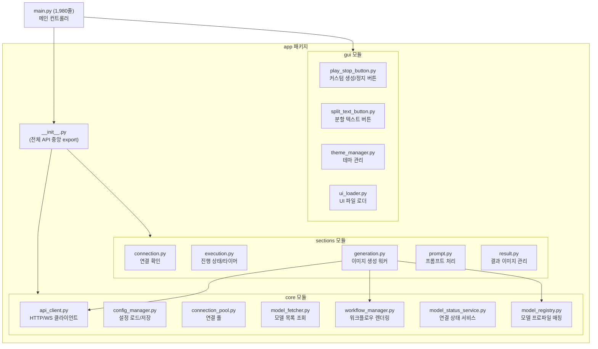

# 🔍 ComfyCraft AI Easy Studio v0.3 — 코드 리뷰 보고서

> **분석 대상**: 프로젝트 전체 (main.py 1,980줄, app 패키지 20개 모듈, JSON 10개, QSS 테마 9개, main.ui 112KB)
> **분석 일시**: 2026-09-11 (재검증판 — 이전 09-10 보고서를 실제 코드와 대조해 고침)
> **말투**: 초보자도 이해할 수 있게 쉬운 한국어로 설명합니다.

---

## 📁 프로젝트 구조 개요



전체적으로 **모듈 분리가 잘 되어 있고**, 기능별로 역할이 명확하게 나뉘어 있습니다.

> **구조 정정 (재검증 결과)**:
> - 이전 보고서의 "약 30개 소스 파일"은 틀렸습니다. 실제 프로젝트 파이썬 파일은
>   `app` 24개 + `main.py` + `assets` 3개 + `tests` 2개 = **32개**이고,
>   여기에 작업용 임시 파일(`_patch.py`, `_update_review*.py` 4개)이 루트에 남아 있습니다.
>   임시 파일은 프로그램과 상관없으니 지우는 것이 좋습니다.
> - JSON은 10개가 맞습니다 (`app_config`, `checkpoint`, `comfyui_nodes_info`,
>   `default_profiles`, `flux_gguf`, `gguf_unet`, `prompt`, `ui_theme`, `zimage`, `zimage_omni`).
> - 테마 QSS는 9개가 맞습니다.
> - UI 파일은 `assets/ui/main.ui` 1개(112,453바이트)입니다.
> - `ui_loader.py`는 `PlayStopButton`만 미리 등록하고,
>   `SplitTextButton`은 등록하지 않고 나중에 이름에 `Button`이 들어간 버튼을
>   찾아서 직접 바꿔치기합니다. 이때 사이드바 안의 버튼은 디자인 유지를 위해
>   일부러 건드리지 않습니다.

---

## ✅ 지금은 문제없는 항목 (예전에는 버그였음)

### 1. `check_connection_silent` — 이미 고쳐져 있습니다 ✅

[connection.py](file:///c:/Users/donian/Desktop/python/comfyui_Lmstudio_gui%20v0.3/app/sections/connection.py#L190-L198)

```python
def check_connection_silent(service: str, url: str, timeout: float = 0.3) -> bool:
    try:
        from app.core.api_client import LMStudioApiClient, ComfyUIApiClient  # ← ✅ 올바른 모듈!
```

**이전 문제**: 예전에는 `from src import ...`라고 써 있어서 이 프로젝트에 없는
`src` 패키지를 찾으려다 항상 실패했습니다.

**지금 상태**: 현재 코드에서는 `from app.core.api_client import ...`로 이미 고쳐져
있습니다. 그래서 이 항목은 **더 이상 버그가 아닙니다.**
관련 테스트(`tests/test_core_components.py`)도 이 함수가 죽지 않고
`False`를 조용히 돌려주는지만 확인합니다.

---

### 2. 백그라운드 스레드의 `QApplication.processEvents()` — 현재는 문제없음 ✅

**이전 문제**: 예전에 `generation.py`의 작업 스레드 안에서
`QApplication.processEvents()`를 불렀습니다.
이 함수는 화면을 그리는 메인 스레드에서만 써야 안전합니다.
작업 스레드에서 부르면 가끔 프로그램이 죽을 수 있습니다.

**지금 상태**: 현재 `app/sections/generation.py` 안에는 `processEvents`가
**0개**입니다. 즉 이미 지워져 있습니다.
유일하게 남은 `processEvents`는 `app/gui/theme_manager.py`의
`apply_theme()` 안에서, 테마를 바꾸는 **메인 스레드**에서 부르는 1번뿐이라
괜찮습니다.

---

### 3. ConfigManager 내부 속성 직접 접근 — 이미 안전한 방법이 생겼습니다 ✅

**이전 문제**: 예전에 `main.py`에서 `self.config_manager._config = ...`처럼
밑줄(`_`)로 시작하는 내부 변수를 바깥에서 직접 고쳤습니다.
내부 변수를 직접 고치면 나중에 프로그램이 꼬일 수 있습니다.

**지금 상태**: 현재 `main.py` 안에는 `config_manager._config` 직접 고치기가
**0개**입니다. 대신 `app/core/config_manager.py`에
`set_config()` 메서드와 `config` 속성(setter 포함)이 이미 만들어져 있어서,
앞으로는 그 안전한 방법을 쓰면 됩니다.

---

## ⚠️ 아직 남은 문제 — 조금씩 고치면 좋아요

### 4. `main.py`가 큼 (1,980줄, 89KB)

[main.py](file:///c:/Users/donian/Desktop/python/comfyui_Lmstudio_gui%20v0.3/main.py)의 `MainController` 클래스는 **거의 모든 화면 동작을 하나의 파일에** 담고 있습니다.

| 메서드/영역 | 줄 수 | 비고 |
|---|---|---|
| `setup()` | ~250줄 | 위젯 초기화 + 시그널 연결 전부 |
| `capture_snapshot()` + FaceDetailer | ~110줄 | 스냅샷 생성 |
| `_restore_facedetailer_from_snapshot()` | ~100줄 | 스냅샷 복원 |
| `_setup_new_studio_features()` | ~130줄 | 추가 UI 기능 |
| `_show_facedetailer_guide()` | ~80줄 | HTML 하드코딩 |
| `_show_settings_dialog()` | ~75줄 | 다이얼로그 생성 |

**개선 방향**:
- FaceDetailer 관련 동작을 별도 파일/클래스로 나누기
- 설정창·도움말창 같은 팝업 화면 코드를 별도 파일로 나누기
- `setup()`을 기능별 작은 함수들로 나누기

---

### 5. FaceDetailer 코드 반복 패턴

`capture_snapshot()`([main.py L1170](file:///c:/Users/donian/Desktop/python/comfyui_Lmstudio_gui%20v0.3/main.py#L1170))과
`_restore_facedetailer_from_snapshot()`([main.py L1244](file:///c:/Users/donian/Desktop/python/comfyui_Lmstudio_gui%20v0.3/main.py#L1244))에서
17개 FaceDetailer 옵션에 대해 **거의 같은 코드가 반복**됩니다.
(`main.py` 안에 `facedetailer`라는 글자가 107번 나옵니다.)

```python
# capture_snapshot 내부 — 17개 각각에 대해 비슷한 코드
facedetailer_denoise = _fd_val("facedetailerDenoiseSlider", 0.40, factor=100.0)
facedetailer_steps = _fd_val("facedetailerStepsSlider", 20)
# ... 15개 더

# _restore_facedetailer_from_snapshot 내부 — 17개 각각에 대해 if + try/except
if "facedetailer_denoise" in snap:
    try:
        self._set_fd_slider("facedetailerDenoiseSlider", round(float(snap["facedetailer_denoise"]) * 100))
    except Exception:
        pass
# ... 15개 더
```

**개선 방향**: 옵션 목록을 표(리스트/딕셔너리)로 만들어서 반복문으로 처리하면
코드를 약 80% 줄일 수 있습니다.

---

### 6. 도움말 HTML이 코드 안에 들어 있음

`_show_facedetailer_guide()`([main.py L1868](file:///c:/Users/donian/Desktop/python/comfyui_Lmstudio_gui%20v0.3/main.py#L1868))에
FaceDetailer 설명 HTML 표가 **파이썬 코드 안에 직접** 들어 있습니다.
글자를 고치려면 파이썬 파일을 열어야 해서 불편합니다.

**개선 방향**: `assets/help/facedetailer_guide.html` 같은 별도 파일로 나누기

---

### 7. 도움말 읽는 코드가 2곳에서 반복됨

`_setup_help_tab()`([main.py L1035](file:///c:/Users/donian/Desktop/python/comfyui_Lmstudio_gui%20v0.3/main.py#L1035))과
`_show_help_dialog()`([main.py L1830](file:///c:/Users/donian/Desktop/python/comfyui_Lmstudio_gui%20v0.3/main.py#L1830))에서
**같은 README.md 파일을 거의 같은 방법으로 읽고 HTML로 바꾸는** 코드가
반복됩니다.

---

### 8. `show_message_box` — 이미 고쳐져 있습니다 ✅

[result.py](file:///c:/Users/donian/Desktop/python/comfyui_Lmstudio_gui%20v0.3/app/sections/result.py#L95-L104)

```python
msg_box.setStyleSheet("QMessageBox QLabel { min-width: 280px; }")
```

**이전 문제**: 예전에는 메시지 박스 안에 검은색 배경(`#1f2937`)이 직접
적혀 있어서, 밝은 테마를 써도 메시지 박스만 항상 어둡게 보였습니다.

**지금 상태**: 현재 코드에는 어두운 색상 코드가 없고,
글자 상자가 최소 280px이 되게 하는 1줄만 남았습니다.
그래서 밝은 테마에서도 어색하지 않습니다. 이 항목은 **해결됨**입니다.

---

## 💡 가벼운 개선 제안

### 9. `comfyui_lmstudio_requirements.txt`는 이미 없습니다 ✅

**이전 문제**: [requirements.txt](file:///c:/Users/donian/Desktop/python/comfyui_Lmstudio_gui%20v0.3/requirements.txt)와
`comfyui_lmstudio_requirements.txt` 2개 파일의 내용이 완전히 같았습니다.

**지금 상태**: 지금 폴더에는 `requirements.txt` 1개만 있습니다.
(`comfyui_lmstudio_requirements.txt` 파일 자체가 없습니다.)
그래서 이 항목은 **해결됨**입니다.

---

### 10. `ConnectionStatus`에 일본어와 한국어가 섞여 있음

[connection.py L23, L84](file:///c:/Users/donian/Desktop/python/comfyui_Lmstudio_gui%20v0.3/app/sections/connection.py#L84)

```python
# L23 — 기본값은 한국어 ✅
message: str = "미확인"
# L84 — 여기서만 일본어 ❌
status = ConnectionStatus(service=service, url=resolved_url, ok=False, message="未確認")
```

프로젝트 전체가 한국어인데, L84 한 줄만 일본어(`未確認`)입니다.
`"미확인"`으로 고치면 됩니다.
(실제로 이 값은 나중에 항상 덮어쓰기 때문에 기능에는 영향이 없습니다.)

---

### 11. `self.worker`를 여러 스레드에서 씀

`start_generation()`([main.py L1389](file:///c:/Users/donian/Desktop/python/comfyui_Lmstudio_gui%20v0.3/main.py#L1389))과
`generation_finished()`([main.py L1457](file:///c:/Users/donian/Desktop/python/comfyui_Lmstudio_gui%20v0.3/main.py#L1457))에서
`self.worker`를 씁니다. (`main.py` 안에 `self.worker`가 16번 나옵니다.)

```python
def start_generation(self):
    if self.worker:  # 일하고 있으면 새로 시작 안 함
        return
    ...
    self.worker = GenerationWorker(...)
    threading.Thread(target=self.worker.run, daemon=True).start()

def generation_finished(self, success):
    self.worker = None  # 끝나면 비움
```

자물쇠(lock) 없이 여러 스레드에서 같은 변수를 씁니다.
지금은 Qt 신호 덕분에 `generation_finished`가 메인 스레드에서 불려서
대부분 괜찮지만, 시작 버튼을 아주 빠르게 여러 번 누르면 꼬일 수 있습니다.

---

### 12. `[DEBUG]` 로그 — 이미 지워져 있습니다 ✅

**이전 문제**: `main.py` 곳곳에 `[DEBUG] ...` 로그가 남아 있어서
사용자가 보는 로그창에 개발자용 메시지가 보였습니다.

**지금 상태**: 현재 `main.py` 안에 `[DEBUG]` 글자는 **0개**입니다.
즉 이미 지워져 있습니다. 이 항목은 **해결됨**입니다.

---

### 13. `except ...: pass`가 5곳에 있음

[main.py L1016, L1140, L1262, L1637, L1643](file:///c:/Users/donian/Desktop/python/comfyui_Lmstudio_gui%20v0.3/main.py#L1016)

```python
except Exception:
    pass
```

오류가 나도 조용히 넘어가면 나중에 고치기 어렵습니다.
최소한 `print()`나 로그 한 줄이라도 남기는 것이 좋습니다.
(L1016 한 곳은 "화면 배치 실패는 무시하는 것이 의도"라고 주석이 있어서 괜찮습니다.)

---

### 14. 테스트가 핵심 동작을 검사하지 않음

지금 테스트는 2개 파일입니다:

- [test_project_basics.py](file:///c:/Users/donian/Desktop/python/comfyui_Lmstudio_gui%20v0.3/tests/test_project_basics.py):
  JSON 파일이 깨지지 않았는지, 버전 글자가 v0.3인지 확인
- [test_core_components.py](file:///c:/Users/donian/Desktop/python/comfyui_Lmstudio_gui%20v0.3/tests/test_core_components.py):
  모델 찾기, 설정 읽기, 연결 확인 함수가 죽지 않는지 확인

프롬프트 다듬기, 워크플로우 만들기, 모델 기본값 고르기 같은
중요한 동작에 대한 테스트는 아직 없습니다.

---

### 15. (고침) ~~`PlayStopButton` 글자 문제~~

> **조치 완료**: `play_stop_button.py`의 `_on_toggled()`에서
> `"정지" if checked else "이미지생성 시작"`으로 고쳤습니다.
> 현재 코드에 띄어쓰기가 이상한 `"정 지"`는 없습니다.

---

## ✅ 잘 된 점

| 영역 | 평가 |
|---|---|
| **모듈 나누기** | core/gui/sections 3층으로 잘 나뉨 |
| **설정 관리** | dataclass 기반 AppConfig + `set_config()`/`config` 속성까지 있음 |
| **모델 프로파일** | 자동 찾기 + JSON으로 늘릴 수 있는 구조 |
| **워크플로우 템플릿** | 빈칸 채우기 방식이라 유연함 |
| **테마 시스템** | 9개 테마, QSS 기반, 선택 저장, 커스텀 버튼 색상 자동 변경 |
| **API 클라이언트** | 자동 재시도, 세션 관리 포함 |
| **캐싱** | 모델 목록을 잠시 저장해 두는 캐시 있음 |
| **UI 로더** | 버튼을 자동으로 예쁜 버튼으로 교체 (PlayStopButton, SplitTextButton) |
| **한국어 화면** | 화면 글자와 오류 메시지가 한국어 |
| **버튼 테마 연동** | SplitTextButton/PlayStopButton에 `updateThemeColors()`가 있어서 테마를 바꾸면 색상 자동 변경 |

---

## 🆕 테마 시스템 개선 (2026-09-10, 재검증: 2026-09-11)

### 바뀐 내용

**문제**: 예쁜 버튼(`SplitTextButton`, `PlayStopButton`)이 테마가 바뀌어도
색이 그대로였습니다. 파랑(`#275efe`), 파랑(`#0078D4`), 빨강(`#C42B1C`)이
코드 안에 직접 적혀 있었기 때문입니다.

**해결**: 각 예쁜 버튼에 `updateThemeColors()`라는 **함께 쓰는 함수**(클래스 메서드)를
넣고, `theme_manager.py`에 테마별 색상 표를 만들었습니다.
테마가 바뀌면 모든 버튼의 색이 자동으로 바뀝니다.

### 고친 파일

| 파일 | 바뀐 내용 |
|------|-----------|
| `app/gui/split_text_button.py` | `setStatus()`/`getStatus()`/`status` 속성, `updateThemeColors()`, `_apply_theme_color()` 있음 (확인됨) |
| `app/gui/play_stop_button.py` | `_play_color`/`_stop_color` 변수, `updateThemeColors()`, `_apply_theme_color()` 있음 (확인됨) |
| `app/gui/theme_manager.py` | `_SPLIT_TEXT_BUTTON_COLORS`, `_PLAY_STOP_BUTTON_COLORS` 표 있음 (9개 테마) + `apply_theme()`에서 버튼 색 갱신 함수 호출 (확인됨) |
| `main.py` | 연결 상태 표시를 `setProperty("status", ...)` + `setStatus(...)`로 바꿈 (5곳 확인됨) |

### 동작 순서

```
테마 변경 → apply_theme()
  → app.setStyleSheet(QSS로 전체 화면 색 변경)
  → _update_split_text_button_theme(key) (예쁜 글자 버튼 색 변경)
  → _update_play_stop_button_theme(key) (시작/정지 버튼 색 변경)
  → 모든 버튼이 자기 색을 다시 칠함 (_apply_theme_color())
```

### 버튼 상태 종류 (SplitTextButton)

| 상태 | 뜻 |
|------|------|
| `"none"` | 기본 (파랑) |
| `"accent"` | 테마 대표 색상 |
| `"success"` | 성공 (초록) |
| `"error"` | 오류 (빨강) |
| `"warning"` | 경고 (노랑) |
| `"pending"` | 기다림 (회색) |

---

## 📊 요약 — 중요도별 정리

| 중요도 | 항목 | 지금 상태 |
|---|---|---|
| 🟡 중간 | #4 main.py 크기 | 1,980줄 — 나눔 필요 |
| 🟡 중간 | #5 FaceDetailer 반복 | 17개 옵션 반복 — 표+반복문으로 줄이기 |
| 🟢 낮음 | #6 도움말 HTML | 코드 안에 있음 — 별도 파일로 |
| 🟢 낮음 | #7 도움말 코드 반복 | 2곳 반복 — 하나로 합치기 |
| 🟢 낮음 | #10 일본어 1줄 | L84 `未確認` → `미확인` |
| 🟢 낮음 | #11 worker 공유 | 자물쇠 없이 공유 — 시작 버튼 연속 클릭 주의 |
| 🟢 낮음 | #13 조용한 오류 처리 | 5곳 — 로그 한 줄 남기기 |
| 🟢 낮음 | #14 테스트 부족 | 중요 동작 테스트 없음 |
| ✅ 고침 | #1 연결 확인 import | 올바른 모듈로 고쳐짐 |
| ✅ 고침 | #2 작업 스레드 화면 처리 | generation.py에서 지워짐 |
| ✅ 고침 | #3 내부 변수 직접 고치기 | `set_config()` 생김, 직접 고치기 0개 |
| ✅ 고침 | #8 메시지 박스 색 | 어두운 색 지워짐 |
| ✅ 고침 | #9 파일 2개 같음 | 파일 1개만 남음 |
| ✅ 고침 | #12 개발자 로그 | `[DEBUG]` 0개 |
| ✅ 고침 | #15 버튼 글자 | `"정 지"` 없음, 정상 글자로 고쳐짐 |
